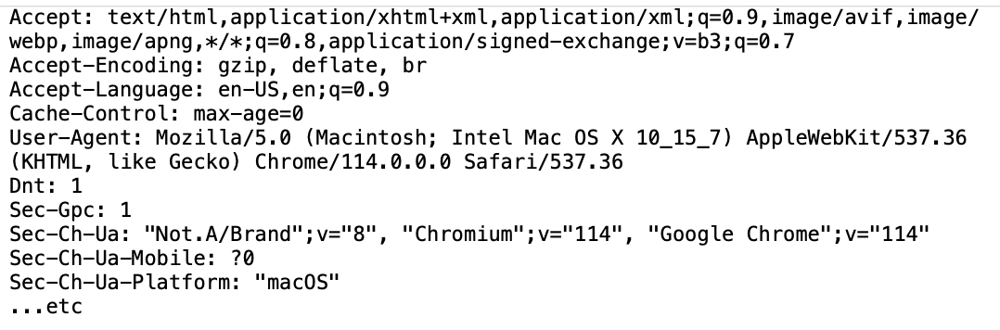

## HTTP request header

Websites need to discover information about the person's browser and operating system capabilities. To address this need websites read field values from the HTTP request header. The header typically includes, among others, a "User-Agent" field that indicates the person's browser version, the operating system the person is using, etc. The site uses these HTTP fields to understand the capabilities of the browser, default language, cookies, etc.

