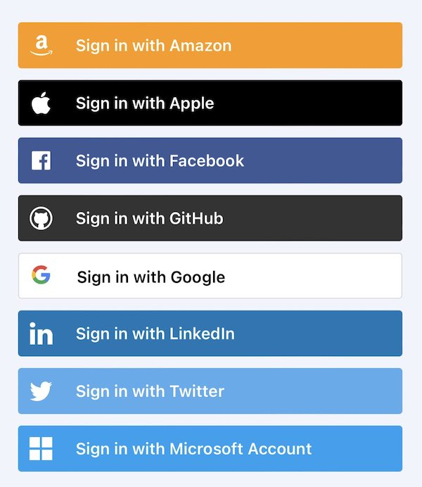

Many of us envision a future where people have personal agents that act as trusted digital intermediaries with apps/sites ("apps"). The agents rebalance the power relationship with the apps. They promise to automate tedious manual processes, and offer entirely new experiences, services, and entertainment, all while preserving privacy.

Some of these personal agents are digital wallets that manage person's crendentials. Others are being developed by entrepreneurs. We can even consider authentication services to be a kind of agent operating on behalf of the person to log them into an app without needing a password.

But there's a problem. How does the app know what kinds of agents a person has before they start using the app? If it can't know this a priori the app has two choices:

- BAD: Ask the person to pick their agent from a list of alternative agent types that the person might use. 
- UGLY: Ask the person to enter an identifier of their agent

We describe more of the problems with the first option below. The second option has been proven to be unworkable.

**In short, an agent needs to be able to present itself to an app/site and provide the app/site a way to discover its capabilities**

Once the app/site knows the person has an agent of a certain type and the app/site has a way to discover the agent's capabilities, the app/site can do things like:
- ask the agent to perform services on behalf of the person 
- display a button representing the agent type and ask the person to tap the button to engage with an agent of this type

This problem has not been solved in a general way, although partial solutions exist.

## Example: Authentication

An app instead of, or in addition to, authenticating the person using a username and password may wish to rely on external authentication mechanisms (e.g. Continue-with-Facebook) to authorize the person. For each supported option the website displays a buttton. If there are too many options the resulting site starts to look like a car at NASCAR. Too many options is ugly, confusing, and inconvenient.

Why so many? Because some authentication methods (e.g. OpenID Connect) use a standard protocol that can be implemented by any number of IdPs. For example, there are dozens of OpenID Connect IdPs each with its own logo-ed button such as Continue-with-Google, Continue-with-Twitter, -Apple, -Facebook, -LinkedIn, and so on. 

The problem is exacerbated by new protocols like OpenID SIOP that allow each person to have a *personal IdP* (aka a wallet) from one of hundreds of wallet providers. 

The app/site doesn't know what authentication alternative the person would like to use before the person is looking at the initial app/site screen. The NASCAR problem would be solved if the app/site could (i) discover a priori the set of authentication methods the person has available and (ii) find one or more matches with the set of authentication methods the app/site supports and then (iii) display the matches. The result would be a small, although hopefully not the null, set of alternatives. The app/site would then display a button for each.